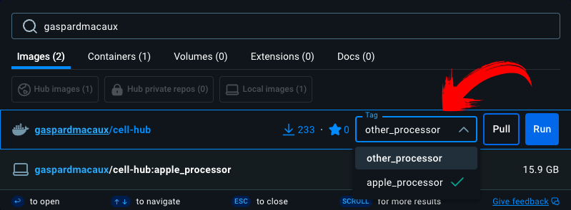
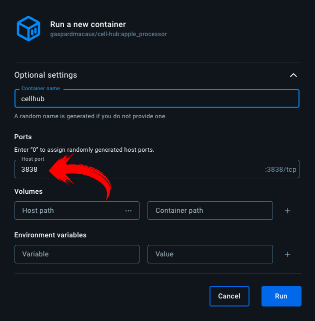
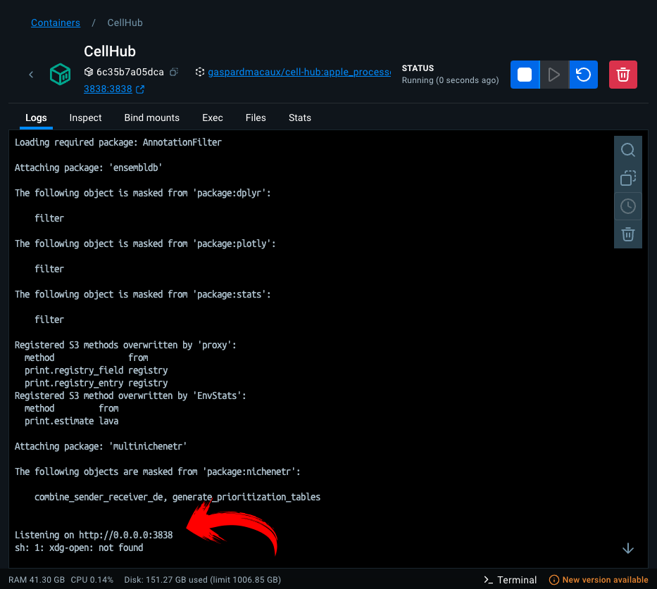
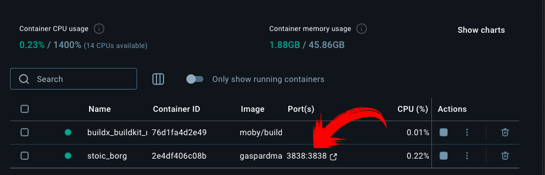

# Getting Started

**First, you need to install Docker Desktop to run our application**

1. Go to Docker Desktop Download Page https://www.docker.com/products/docker-desktop/
2. Download the version for your system (Windows or Mac)
3. Install Docker Desktop by following the installation wizard
4. Start Docker Desktop and wait until it's fully running

## Windows 

**Using Docker Desktop interface:**

1. Open Docker Desktop
2. On the left side, go to the images tab
3. Click on the "Search" box
4. Type: `gaspardmacaux/cell-hub:other_processor`
5. Click "Pull" to download the image

6. Once downloaded, click on the play button

7. It will open a pop-up, where you can enter the name of the docker image and most importantly you will need to set the display port on 3838:3838

8. Wait that all packages are loaded. 

9. Now, go to the containers tab and click on 3838:3838 displayed in blue or go in your web browser and go to: `http://localhost:3838`

**Using command line:**

1. Press `Windows + X` and click "Windows PowerShell" or "Terminal"
2. Type: `docker pull gaspardmacaux/cell-hub:other_processor`
3. Then: `docker run -p 3838:3838 gaspardmacaux/cell-hub:other_processor`
4. Access the application at `http://localhost:3838`

## Mac

**For Mac with Intel chip:**

Same as windows

**For Mac with Apple Silicon chip:**

*Using Docker Desktop interface:*

1. Open Docker Desktop
2. Click on the "Search" box
3. On the left side, go to the images tab
4. Type: `gaspardmacaux/cell-hub:other_processor`
5. Click "Pull" to download the image

6. Once downloaded, click on the play button

7. It will open a pop-up, where you can enter the name of the docker image and most importantly you will need to set the display port on 3838:3838

8. Wait that all packages are loaded. 

9. Now go to the containers tab and click on 3838:3838 displayed in blue or go in your web browser and go to: `http://localhost:3838`

*Using command line:*

1. Open Terminal (Applications > Utilities > Terminal)
2. Type: `docker pull gaspardmacaux/cell-hub:apple_processor`
3. Then: `docker run -p 3838:3838 gaspardmacaux/cell-hub:apple_processor`
4. Wait that all packages are loaded. Access the application at `http://localhost:3838`

## Accessing the Application

Once you have run the Docker container using either the Docker Desktop interface or the command line, you can access the application by opening your web browser and navigating to `http://localhost:3838`.

> **Note:**
> `http://localhost:3838` is the URL where the application is hosted on your local machine. 
> - `localhost` refers to your own computer 
> - `3838` is the port number where the application is running
>
> If the application doesn't load, make sure that the Docker container is running and that you have typed the URL correctly in your web browser.