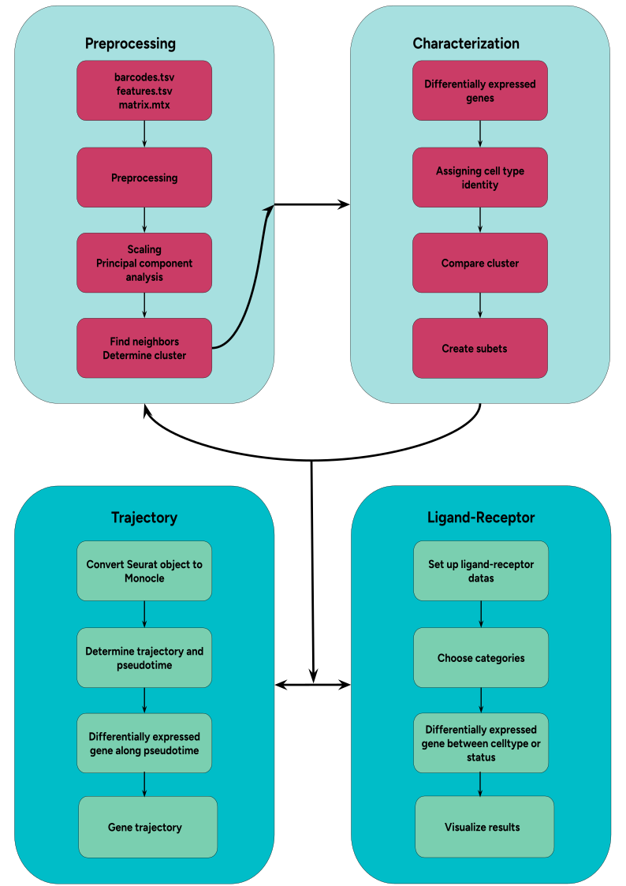

# Overview

Welcome to our integrated single-cell RNA sequencing analysis platform. This application empowers researchers to analyze complex single-cell and single-nucleus RNA sequencing data through an intuitive graphical interface. Whether you're studying cell populations, developmental trajectories, or cell-cell interactions, our platform provides the tools you need without requiring programming expertise.

## Platform Capabilities

Our application integrates four powerful analysis frameworks:

**Seurat: The Core Analysis Engine**
* Comprehensive quality control and preprocessing
* Advanced cell clustering and visualization
* Robust integration of multiple datasets
* Marker gene identification
* Differential expression analysis

**CellChat: Cell Communication Analysis**
* Inference of cell-cell communication networks
* Prediction of ligand-target interactions

**Monocle: Developmental Dynamics**
* Reconstruction of cellular trajectories
* Pseudo-time analysis
* Cell fate mapping and lineage tracing
* Identification of branch points and cell state transitions

## Analysis Pipeline

Our streamlined workflow guides you through each step of single-cell analysis:

1. **Data Processing and Quality Control**
   * Rigorous filtering of cells and genes
   * Normalization and scaling
   * Feature selection
   * Batch effect correction

2. **Core Analysis**
   * Dimensional reduction (PCA, UMAP)
   * Cell population identification
   * Marker gene discovery
   * Expression analysis

3. **Advanced Applications**
   * Developmental trajectory mapping
   * Cell-cell communication networks
   * Multi-sample integration
   * Complex comparative studies

## Key Publications and Resources

### Publications

* Seurat: Hao et al., Nature Biotechnology (2024)
* Cellchat: Jin et al., Nature Protocols (2025)
* Monocle: Cao et al., Nature (2019)

### Online Resources

Documentation and Tutorials:
* Seurat: https://satijalab.org/seurat/
* CellChat: https://htmlpreview.github.io/?https://github.com/jinworks/CellChat/blob/master/tutorial/CellChat-vignette.html#load-the-required-libraries
* Monocle3: http://cole-trapnell-lab.github.io/monocle3/
