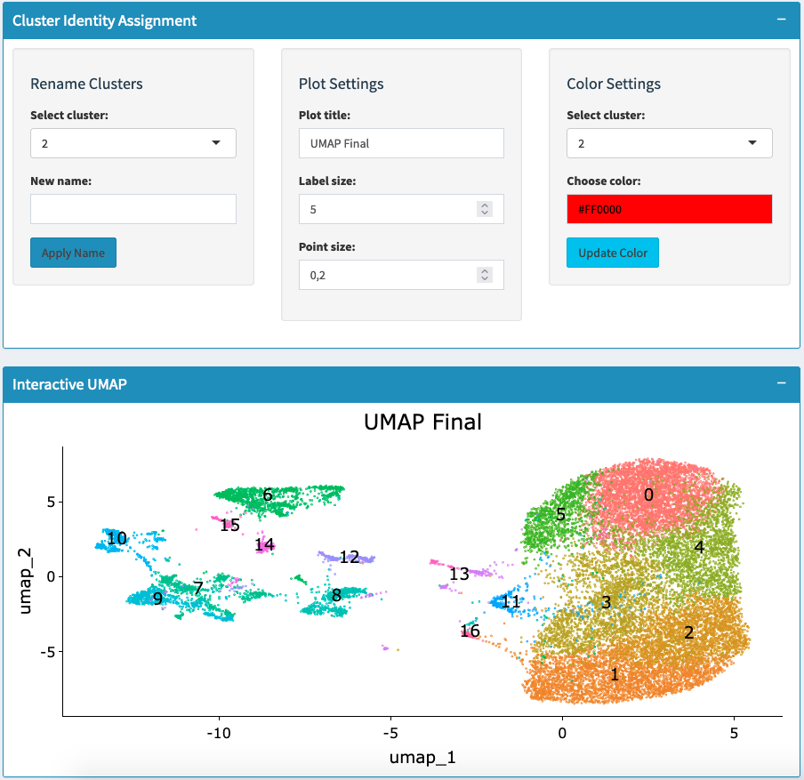

# Assigning Cell Identity - Multiple Datasets

## Overview
This section allows you to assign biological names to clusters across your integrated datasets. You can rename clusters with meaningful cell type names, customize visualization colors, and validate assignments using expression plots - all while maintaining consistency across multiple experimental conditions.

## What You'll Do on This Tab
- **Rename clusters** with biologically meaningful names across all datasets
- **Customize colors** for consistent visualization across conditions
- **Validate assignments** using expression plots from integrated data
- **Create annotated visualizations** ready for comparative analysis

## Cluster Renaming Process

### How to Rename Clusters

**Step 1: Select Target Cluster**
- Use "Select cluster" dropdown to choose which cluster to rename
- Shows current cluster name (usually a number like "0", "1", "2")
- Renaming applies across all datasets simultaneously

**Step 2: Enter Biological Name**
- Type new cell type name in "New name" field
- Use consistent biological nomenclature (e.g., "T cells", "Macrophages", "Stem cells")
- Consider names that work across all your experimental conditions

**Step 3: Apply Changes**
- Click "Apply Name" to rename the selected cluster
- Change is applied across all datasets in the integration
- Can rename multiple clusters by repeating the process

### Cluster Merging
**Automatic Merging**:
- Give two different clusters the same name to merge them
- Useful when integration split one cell type into multiple clusters
- Example: Rename clusters "2" and "5" both to "Myoblasts" to merge them

## Visualization Customization

### Plot Settings
**Appearance Control**:
- **Plot title**: Change main title for the integrated visualization
- **Label size**: Adjust cluster name text size for readability
- **Point size**: Modify cell dot size for optimal viewing
- **Show cluster labels**: Toggle cluster name display on/off

### Color Management
**Assign Custom Colors**:
- Select cluster from dropdown
- Choose color using color picker
- Click "Update Color" to apply across all datasets
- Maintains consistency in comparative visualizations

**Color Strategy**:
- Use biologically meaningful colors when possible
- Ensure sufficient contrast between similar cell types
- Keep colors consistent across all comparative analyses

## Validation Tools

### Interactive UMAP Display
**Main Visualization**:
- Shows integrated clusters with current names and colors
- Displays how datasets integrate together
- Updates automatically when clusters are renamed
- Interactive plot allows detailed exploration

### Alternative Plot Validation
**Expression Plot Options**:
- Choose from: FeaturePlot, VlnPlot, DotPlot, or RidgePlot
- Use to validate cell type assignments across datasets
- Check marker gene expression in assigned clusters

**Validation Workflow**:
1. Select plot type that best shows your validation genes
2. Examine expression patterns across datasets
3. Confirm cluster identity is consistent across conditions
4. Adjust naming if expression doesn't match expectations

## Analysis Pipeline

### Step 1: Prepare for Annotation
- Review marker genes known for your tissue/system
- Consider expected cell types across all experimental conditions
- Note expression patterns observed in previous visualization steps

### Step 2: Start with Clear Clusters
- Begin with clusters showing strong, consistent marker expression
- Rename obvious cell types first
- Focus on clusters that appear in multiple datasets

### Step 3: Systematic Validation
- For each renamed cluster, validate across all datasets
- Use multiple plot types to confirm marker expression
- Ensure assignments make sense across experimental conditions

### Step 4: Handle Integration-Specific Cases
**Dataset-Specific Clusters**:
- Some clusters may appear only in certain conditions
- Consider names reflecting this (e.g., "Activated_T_cells" if only in treatment)

**Integration Artifacts**:
- Check if small clusters represent integration artifacts
- May need merging with related clusters
- Validate with biological knowledge

## Export 

### Save Annotated Object
- Click "Save Seurat Object" to preserve all annotations
- Includes cluster names, colors, and integration results
- Essential for reproducible comparative analysis

