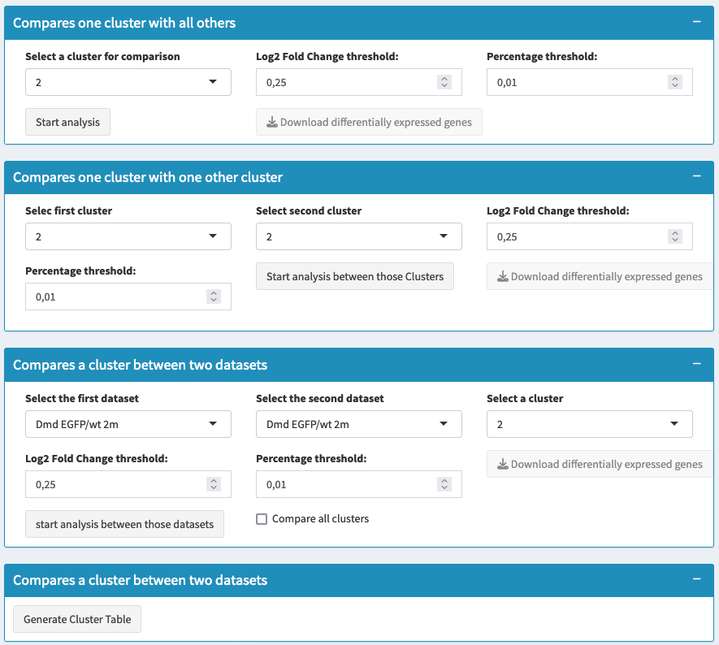

# Cluster Comparison - Multiple Datasets

## Overview
This section provides comprehensive tools for comparing clusters and identifying differentially expressed genes across multiple datasets. You can compare individual clusters, analyze differences between datasets, create Venn diagrams from gene lists, examine cluster composition, and study gene co-expression patterns.

## What You'll Do on This Tab
- **Compare clusters** within and between datasets
- **Identify dataset-specific** gene expression differences
- **Analyze cluster composition** across experimental conditions
- **Create Venn diagrams** from differential expression results
- **Examine gene co-expression** patterns across datasets and clusters
- **Export all results** for further analysis

## Differential Expression Analysis Types

### 1. One Cluster vs All Others

**When to use**: Find genes that uniquely characterize a specific cluster across all datasets

**Setup**:
- **Select target cluster**: Choose cluster to compare against all others
- **Set Log2FC threshold**: Minimum fold-change difference (default: 0.25)
- **Set percentage threshold**: Minimum expression percentage (default: 0.01)
- **Click "Start analysis"** to identify cluster-specific genes

**Results**: Genes highly expressed in your target cluster compared to all other clusters

### 2. Cluster vs Cluster Comparison

**When to use**: Compare two specific clusters directly across datasets

**Setup**:
- **Select Group 1 clusters**: Choose clusters for first comparison group
- **Select Group 2 clusters**: Choose clusters for second comparison group  
- **Use same statistical parameters** as above
- **Click "Start analysis between those clusters"**

**Results**: Genes that differ between your selected cluster groups

### 3. Dataset Comparison for Selected Clusters

**When to use**: Compare gene expression between datasets within specific cluster(s)

**Setup**:
- **Select datasets for Group 1**: Choose datasets for first comparison
- **Select datasets for Group 2**: Choose datasets for second comparison
- **Choose clusters to analyze**: Select specific clusters or "Compare all clusters"
- **Set statistical parameters** and run analysis

**Results**: Genes that differ between datasets within the same cell type



## Understanding Results Tables

### Differential Expression Columns
**Gene**: Gene identifier with clickable links to databases
**avg_log2FC**: Average log2 fold change (positive = higher in target group)
**pct.1**: Percentage of cells expressing gene in target group
**pct.2**: Percentage of cells expressing gene in comparison group
**p_val_adj**: Adjusted p-value for statistical significance

### Result Interpretation
**Strong markers**: High avg_log2FC + High pct.1 + Low pct.2 + Low p_val_adj
**Condition-specific genes**: Present in one dataset but not others
**Conserved differences**: Consistent across multiple dataset comparisons

## Advanced Analysis Tools

### Cluster Composition Analysis

**Purpose**: Quantitative overview of cluster sizes across datasets

**Process**:
- Click "Generate Cluster Table" to analyze composition
- View table showing cell counts and percentages per cluster per dataset
- Identify clusters that vary in size between conditions

**Results Table**:
- **Cluster names** with biological annotations
- **Cell counts** per dataset
- **Percentage distribution** across conditions
- **Visual size indicators** for easy comparison

### Venn Diagram Analysis

**When to use**: Compare gene lists from multiple differential expression analyses

**Setup**:
1. **Select up to 3 gene lists** from previous differential expression results
2. **Configure filtering** for each list:
   - Include only significant genes
   - Set Log2FC thresholds
   - Choose p-value cutoffs
3. **Set gene direction**: Up-regulated, down-regulated, or both
4. **Choose colors** for each comparison set
5. **Generate Venn diagram**

**Results**:
- Visual overlap between gene lists
- Tables showing unique and shared genes
- Export options for overlapping gene sets

### Gene Co-expression Analysis

**Purpose**: Examine how multiple genes are expressed together across datasets and clusters

**Setup**:
- **Enter genes of interest** (comma-separated list)
- **Set expression threshold**: Minimum level to count as expressing
- **Choose grouping strategy**:
  - Primary grouping: By dataset or by cluster
  - Secondary grouping: Optional additional breakdown
- **Run co-expression analysis**

**Results**:
- **Co-expression table**: Shows expression combinations across groups
- **Visualization plot**: Graphical representation of co-expression patterns
- **Summary statistics**: Overview of expression coordination

## Analysis Pipeline

### Step 1: Systematic Cluster Characterization
- Run "One vs All" analysis for each major cluster
- Identify core marker genes for each cell type
- Document cluster-specific signatures

### Step 2: Detailed Pairwise Comparisons
- Compare similar clusters to find distinguishing features
- Use "Cluster vs Cluster" for closely related cell types
- Focus on biologically relevant comparisons

### Step 3: Dataset-Specific Analysis
- Compare same clusters between different datasets
- Identify condition-specific gene expression changes
- Use "Dataset Comparison" for treatment effects

### Step 4: Integration Analysis
- Generate cluster composition overview
- Create Venn diagrams to find shared signatures
- Analyze gene co-expression across conditions

### Step 5: Export and Documentation
- Download all differential expression results
- Save Venn diagram gene lists
- Export co-expression analysis for pathway studies

```{tip}
Start with cluster vs all comparisons to identify obvious markers, then use dataset comparisons to find condition-specific changes. Venn diagrams help identify core vs condition-specific gene signatures.
```

## Export Options

### Available Downloads
- **Differential expression CSV files**: Complete results with all statistics
- **Cluster composition table**: Cell counts and percentages
- **Venn diagram plots**: High-resolution visualizations
- **Gene overlap lists**: Shared and unique genes from Venn analysis
- **Co-expression results**: Detailed co-expression patterns
- **Seurat object**: Updated object with all analysis results


