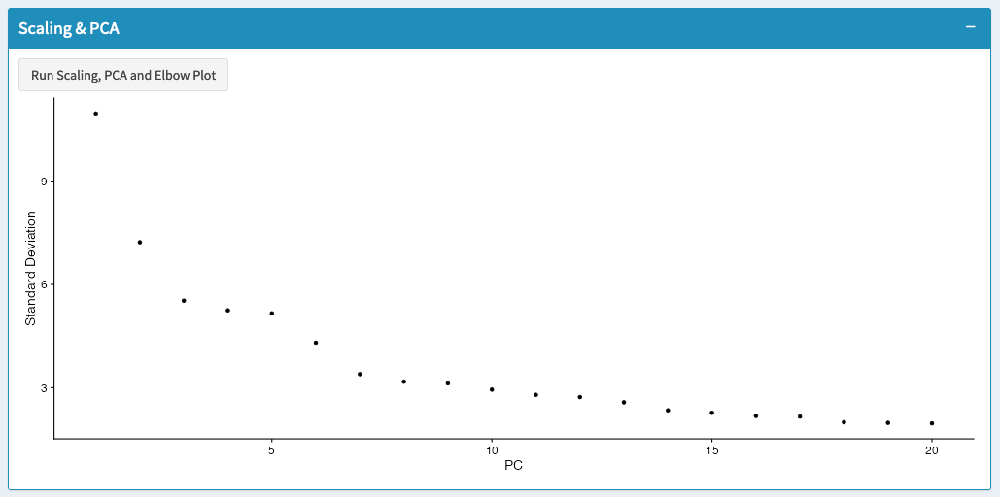
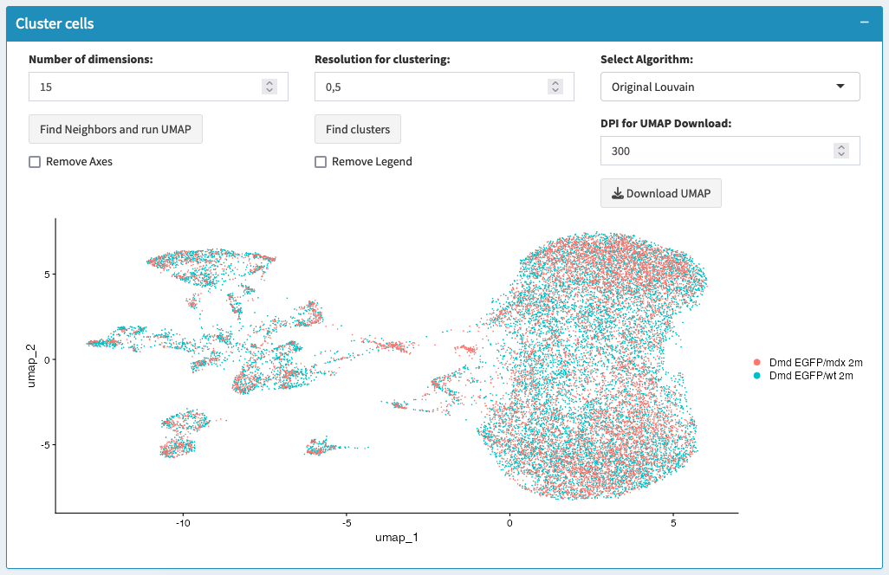
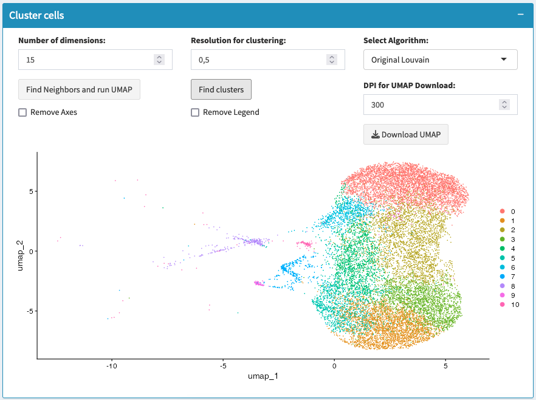

# Clustering Multiple Datasets

## Overview
This section performs dimensional reduction and clustering on your integrated datasets. It handles the challenges of analyzing multiple datasets together by scaling data, reducing dimensions, optionally correcting batch effects with Harmony, and finally clustering cells across all datasets.

## What You'll Do on This Tab
- **Scale data and run PCA** to reduce dimensionality across all datasets
- **Apply Harmony integration** (optional) to correct batch effects between datasets
- **Find neighbors and run UMAP** to visualize integrated data
- **Perform clustering** to identify cell populations across datasets

## Analysis Pipeline

### Step 1: Scaling, PCA and Elbow Plot

**What scaling and PCA do for multiple datasets**:
- **Scaling**: Normalizes gene expression to make datasets comparable
- **PCA**: Identifies main sources of variation across all datasets combined
- **Elbow Plot**: Shows how much variation each component explains

**Process**:
- Click "Run Scaling, PCA and Elbow Plot"
- System scales expression data from all datasets together
- Calculates principal components capturing variation across datasets
- Generates elbow plot to guide dimension selection

**Elbow Plot Interpretation**:
- Shows optimal number of dimensions to use for integration
- Look for the "elbow" where variance explained plateaus
- Use this information for subsequent steps

### Step 2: Harmony Integration (Optional)

**What Harmony does**:
- Corrects batch effects between datasets while preserving biological variation
- Aligns similar cell types from different datasets
- Creates harmonized dimensional reduction space

**When to use Harmony**:
- Datasets from different batches, labs, or protocols
- Visible separation by dataset rather than biology in PCA
- Want to focus on biological rather than technical differences

**Harmony Settings**:
- **Variables to integrate**: Choose which metadata columns contain batch information (usually "dataset")
- **Number of dimensions**: How many PCs to use (default: 15, guided by elbow plot)

**Process**:
- Click "Run Harmony Integration" 
- Select variables containing batch information
- System corrects for technical differences between datasets

### Step 3: Find Neighbors and Run UMAP

**What neighbors calculation does**:
- Identifies cells with similar expression profiles across all datasets
- Creates network of cell-to-cell relationships
- Foundation for both clustering and UMAP visualization

**Number of Dimensions Parameter**:
- How many principal components (or Harmony components) to use
- Default: 15 dimensions
- Use elbow plot to guide selection
- More dimensions = more detail, but potentially more noise

**UMAP Visualization**:
- Creates 2D representation of high-dimensional data
- Shows how datasets integrate together
- Reveals cell population structure across datasets

**Process**:
- Set number of dimensions based on elbow plot
- Click "Find Neighbors and run UMAP"
- System calculates similarities and creates visualization

### Step 4: Clustering

**What clustering does for multiple datasets**:
- Groups similar cells together across all datasets
- Identifies shared cell populations between datasets
- Reveals dataset-specific vs shared cell types

**Resolution Parameter**:
- Controls how many clusters are created (default: 0.5)
- **Lower values (0.1-0.3)**: Fewer, broader clusters
- **Higher values (0.8-2.0)**: More, finer clusters
- Start with 0.5 and adjust based on results

**Algorithm Options**:
- **Original Louvain**: Fast, reliable for most datasets
- **Louvain with Multilevel Refinement**: More thorough, better for complex data
- **SLM Algorithm**: Fastest for very large datasets

**Process**:
- Set resolution based on expected cell type diversity
- Choose clustering algorithm
- Click "Find clusters"
- System identifies cell populations across datasets

## Parameter Selection Guide

### Dimensions for Analysis
- **Too few dimensions**: May miss important biological variation
- **Too many dimensions**: Include noise and batch effects
- **Recommended**: Use elbow plot guidance, typically 10-30 dimensions

### Harmony Integration
- **Always integrate when**: Datasets from different batches, protocols, or time points
- **Skip integration when**: High-quality matched datasets with minimal batch effects
- **Variables to integrate**: Usually "dataset", sometimes additional batch variables

### Clustering Resolution
- **For exploratory analysis**: Start with 0.5
- **For known cell types**: Adjust to match expected number of populations
- **For fine-scale analysis**: Use higher resolution (0.8-1.5)
- **For broad populations**: Use lower resolution (0.2-0.4)

## References
1. Korsunsky, I., Millard, N., Fan, J. et al. Fast, sensitive and accurate integration of single-cell data with Harmony. Nat Methods 16, 1289–1296 (2019). https://doi.org/10.1038/s41592-019-0619-0