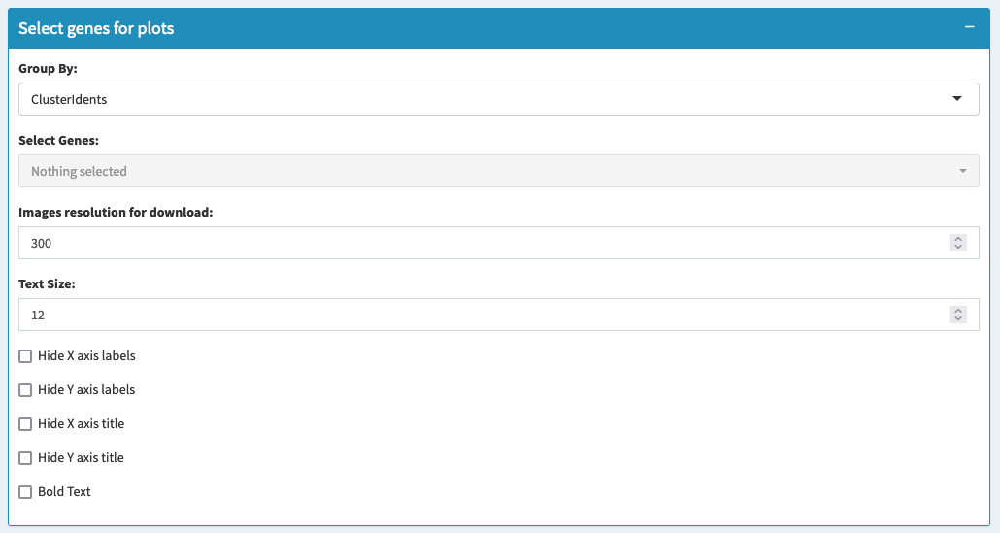
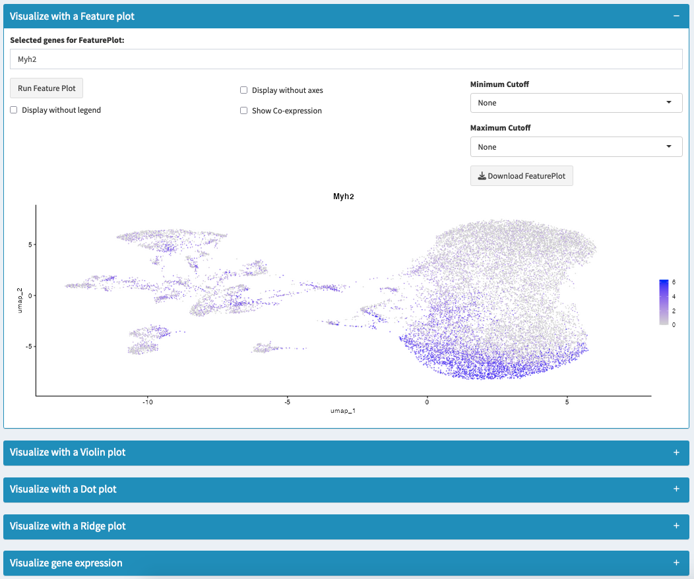

# Plot Gene Expressions - Multiple Datasets

## Overview
This section allows you to visualize gene expression patterns across your integrated datasets using multiple plot types. You can compare expression between datasets, clusters, or custom metadata groups to understand how genes behave across different experimental conditions.

## What You'll Do on This Tab
- **Visualize gene expression** across datasets and clusters simultaneously
- **Compare expression patterns** between different experimental conditions  
- **Use multiple plot types** to examine expression from different perspectives
- **Analyze cell populations** expressing specific gene combinations
- **Export results** and save integrated Seurat objects

## Expression Visualization Setup

### Grouping and Comparison Options

**Group By Selection**:
- **Dataset**: Compare expression between different datasets (Control vs Treatment)
- **Seurat Clusters**: Compare between cell types/clusters
- **Custom Metadata**: Use metadata columns you added (e.g., Time_point, Condition)

**Split By and Comparison Mode** (when Group By = Dataset):
- **Split by**: Choose additional metadata column for sub-grouping
- **Comparison Mode**: 
  - **Split by clusters**: Show each cluster separated by datasets
  - **Compare selected clusters**: Focus on specific clusters between datasets

### Gene Selection System

**Global Gene Selector**:
- **Select Genes dropdown**: Choose from all genes across your datasets
- **Auto-fill feature**: Selected genes automatically fill all plot input fields
- **Search function**: Find specific genes quickly

**Manual Gene Entry** (for each plot type):
- Enter gene names separated by commas (e.g., "Pax7, Myod1, Myog")
- Overrides global selection for that specific plot
- Allows different genes for different visualization types

### Assay Selection

**Available Assays**:
- **RNA**: Original normalized expression data
- **Integrated**: Batch-corrected expression values (if integration was performed)

**When to use each**:
- **RNA assay**: For most standard comparisons, preserves original expression levels
- **Integrated assay**: When comparing across datasets with batch correction applied



## Visualization Methods

### Feature Plot
**What you see**: Gene expression overlaid on UMAP coordinates, split by datasets or conditions

**When to use**: 
- Compare spatial expression patterns between datasets
- See if gene expression locations are conserved across conditions
- Identify dataset-specific expression patterns

**How to read**:
- Each panel = one dataset or condition
- Color intensity = expression level
- Spatial distribution shows which cell populations express the gene

### Violin Plot  
**What you see**: Expression distribution across clusters, grouped by datasets or conditions

**When to use**:
- Compare expression levels between datasets within the same cell type
- See expression variability within clusters across conditions
- Identify condition-specific expression changes

**How to read**:
- X-axis = clusters or datasets (depending on grouping)
- Y-axis = expression level
- Violin width = number of cells at each expression level
- Different colors/panels = different comparison groups

### Dot Plot
**What you see**: Summary of expression across multiple genes and conditions

**When to use**:
- Compare many genes across datasets simultaneously
- Get quantitative view of expression differences
- Create publication-ready comparison figures

**How to read**:
- **Dot size**: Percentage of cells expressing the gene
- **Dot color**: Average expression level in expressing cells  
- Rows = genes, columns = clusters/datasets
- Easy to spot expression differences between conditions

### Ridge Plot
**What you see**: Expression density curves for each cluster/dataset

**When to use**:
- Alternative to violin plots when you have many groups
- Better visualization of expression distributions
- Compare expression patterns across multiple conditions

**How to read**:
- Each "ridge" = one cluster or dataset
- Peak height = number of cells at that expression level
- Peak position = expression level
- Overlapping ridges show expression differences



## Cell Expression Analysis

### Quantitative Expression Summary

**Purpose**: Get precise numbers of cells expressing your genes across datasets and clusters

**Setup**:
- **Gene selection**: Use dropdown or manual entry
- **Expression threshold**: Minimum level to count as "expressing" (default: 1)
- **Analysis scope**: Examines all datasets and clusters simultaneously

**Results Table**:
- Shows number and percentage of expressing cells
- Broken down by dataset and cluster
- Useful for quantifying expression differences between conditions

**Export**: Download summary as CSV for statistical analysis or documentation

## Analysis Workflow

### Step 1: Choose Your Comparison Strategy
- **Between datasets**: Set Group By = "dataset" to compare conditions
- **Between cell types**: Set Group By = "seurat_clusters" to compare populations  
- **Complex comparisons**: Use custom metadata with split options

### Step 2: Select Genes of Interest
- Use global selector for consistent genes across all plots
- Or customize gene lists for each plot type based on your questions

### Step 3: Generate Visualizations
- Start with Feature Plot for overview of expression patterns
- Use Violin Plot for detailed distribution comparisons
- Use Dot Plot for systematic multi-gene analysis
- Use Ridge Plot for alternative distribution view

### Step 4: Quantify and Export
- Run Cell Expression Analysis for precise measurements
- Export plots and data for documentation
- Save updated Seurat object with analysis annotations

## Practical Examples

### Treatment vs Control Comparison
- Group By: "dataset"
- Genes: Treatment response markers
- Look for: Expression changes between conditions

### Cell Type Conservation  
- Group By: "seurat_clusters"
- Split by: "dataset" 
- Look for: Consistent markers across datasets

### Time Course Analysis
- Group By: Custom "Time_point" metadata
- Genes: Developmental markers
- Look for: Expression progression over time

```{tip}
Start with Feature Plots to see overall patterns, then use Violin or Dot Plots to quantify differences. The Cell Expression Analysis gives you exact numbers for statistical comparisons.
```

## Export and Documentation

### Available Downloads
- **Individual plot downloads**: Each plot type has its own download button
- **Multiple formats**: PNG, JPEG, TIFF, SVG, PDF
- **Resolution control**: Adjust DPI for publication quality
- **Cell expression data**: CSV export of quantitative analysis
- **Seurat object**: Save integrated object with all analyses

### File Organization
- Use consistent naming for downloaded files
- Document parameters used for reproducibility
- Save both plots and quantitative data

```{warning}
When comparing between datasets, ensure the comparison is biologically meaningful. Technical differences between datasets can create apparent expression differences that aren't biologically relevant.
```

## Troubleshooting

**No expression visible?**
- Check if genes are present in your datasets
- Verify expression threshold isn't too high
- Ensure correct assay is selected

**Unexpected patterns between datasets?**
- May indicate batch effects not fully corrected
- Check if integration parameters need adjustment
- Validate findings with known biology

**Plots too crowded?**
- Focus on specific clusters or conditions
- Use higher expression thresholds
- Split complex comparisons into multiple plots