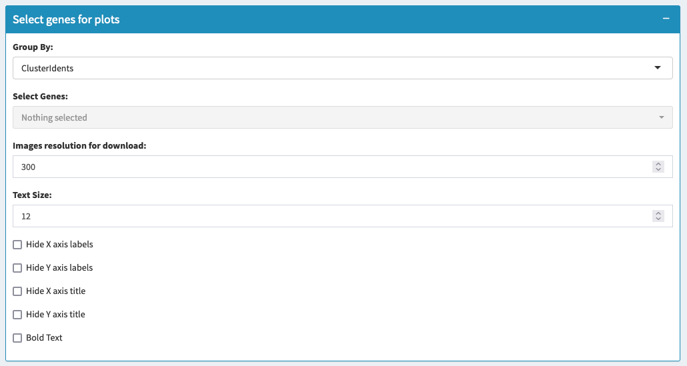
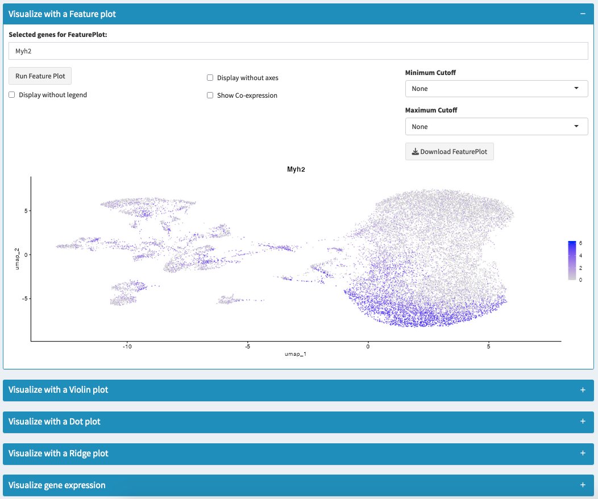

==========================
Visualizing Gene Expression
==========================

### Overview

Visualizing gene expression is an essential step in understanding the distribution and variability of specific genes across different cell populations. This section provides various visualization tools to explore gene expression in your integrated datasets.

### Types of Plots Available

1. **Feature Plot**:  
   Displays the spatial expression of genes on a UMAP or PCA plot. Useful for visualizing gene co-expression and identifying marker genes for specific clusters.

2. **Violin Plot**:  
   Shows the distribution of gene expression levels across different clusters. Useful for comparing gene expression between clusters and identifying marker genes.

3. **Dot Plot**:  
   Represents the expression of multiple genes across clusters. Each dot’s size represents the percentage of cells expressing the gene, and the color represents the average expression level.

4. **Ridge Plot**:  
   Displays the density of gene expression levels for each cluster. Useful for visualizing gene expression distributions within clusters.

### How to Use the Visualization Tools

1. **Select Genes**:  
   Use the dropdown menu to select one or more genes of interest to visualize.

2. **Choose the Appropriate Plot Type**:  
   Select the desired plot type (Feature Plot, Violin Plot, Dot Plot, or Ridge Plot) based on the analysis goals.

3. **Customize Plot Settings**:  
   - Adjust settings such as text size, axes visibility, and color scale to enhance the visual clarity of the data.
   - For Feature Plot, select the minimum and maximum cutoff values to refine the expression levels displayed.

4. **Generate and Analyze the Plot**:  
   - Click the appropriate button ("Run Feature Plot", "Run Vln Plot", etc.) to generate the plot.
   - Analyze the gene expression patterns across different clusters or conditions.

5. **Download the Plot**:  
   Use the provided download buttons to export the generated plots in PNG format for further analysis or presentation.

.. tip::  
   Use the Feature Plot to visualize spatial gene expression patterns and identify co-expressed genes within the same cluster.

.. warning::  
   Ensure that selected genes are present in the dataset to avoid missing data errors. Cross-check gene availability using the gene list provided during the data upload step.

### Additional Analysis

- **Gene Expression Summary**:  
  - Input the genes you want to analyze and set an expression threshold.
  - Click "Analyze Expression" to summarize the number and percentage of cells expressing the selected genes across different clusters and datasets.
  - Download the summary table in CSV format for further analysis.

### Applications

- **Marker Gene Identification**:  
  Use visualization tools to identify and validate marker genes for different cell types or clusters.

- **Data Exploration**:  
  Explore the heterogeneity of gene expression across different conditions or experimental setups.

### Troubleshooting

- **Error in Plot Generation**:  
  Ensure that the selected genes are present in the dataset and that the Seurat object contains the required data layers.

- **Blank or Unexpected Plots**:  
  Adjust the cutoff values or check the group by parameter to ensure the correct metadata fields are used for visualization.

By using these visualization tools, you can gain deeper insights into the expression patterns and variability of genes within your integrated single-cell RNA sequencing datasets.
