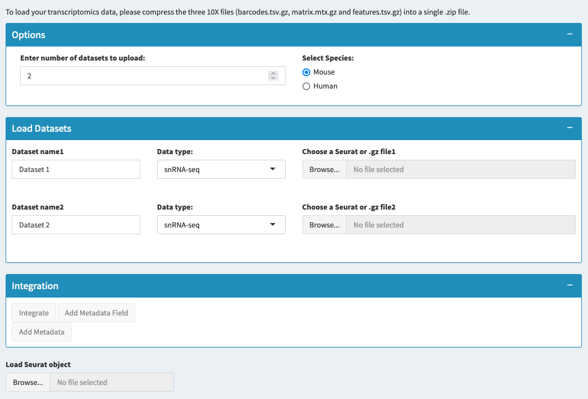

# Load Multiple Datasets

## Overview
This section allows you to analyze integrated datasets from multiple experiments or conditions. You can either load an already integrated Seurat object or upload multiple individual datasets to integrate them together. This enables comparative analysis across different experimental conditions, treatments, or time points.

## What You'll Do on This Tab
- **Load multiple datasets** and integrate them for comparative analysis
- **Apply quality control** parameters to each dataset during processing
- **Choose integration method** - standard integration or simple merge
- **Add custom metadata** to organize datasets into groups
- **Create unified analysis** from multiple experimental conditions

## Loading Options Available

### Option 1: Load Multiple Raw Datasets

**When to use**: You have separate datasets that need to be integrated together

**Setup Process**:
1. **Click "Load Multiple Datasets"** to open the configuration modal
2. **Choose number of datasets** to upload (minimum 2)
3. **Select species** (Mouse, Human, or Rat) - must be consistent across all datasets

**Quality Control Parameters** (applied to all datasets):
- **Minimum features per cell**: Remove cells with too few genes (default: 200)
- **Maximum features per cell**: Remove potential doublets (default: 4000) 
- **RNA Mitochondrial %**: Filter cells with high mitochondrial content (default: 5%)

**Dataset Configuration**:
For each dataset:
- **Enter dataset name**: Give meaningful names (e.g., "Control", "Treatment", "Day3")
- **Choose data type**: 
  - snRNA-seq: Single nucleus data
  - Multiome: Multi-modal data  
  - Seurat Object: Pre-processed .rds file
- **Browse and upload**: Select ZIP file (for raw data) or .rds file (for Seurat objects)

**Integration Method**:
- **Standard Integration**: Corrects batch effects, aligns datasets
- **Simple Merge**: Combines datasets without integration, preserves original clusters

**Final Step**: Click integration button to process all datasets

### Option 2: Load Pre-integrated Object

**When to use**: You already have a Seurat object containing multiple integrated datasets

**Process**:
1. Go to "Load Pre-integrated Object" tab
2. Browse and select your integrated .rds file
3. System loads the object with preserved integration and annotations



## Integration Methods Explained

### Standard Integration
**What it does**:
- Identifies shared cell types across datasets
- Corrects for batch effects and technical differences
- Aligns similar cell populations
- Creates integrated dimensional reduction space

**When to use**:
- Datasets from different experiments or batches
- Want to remove technical variation while preserving biological differences
- Comparing treatments or conditions

### Simple Merge  
**What it does**:
- Combines datasets without changing their structure
- Preserves original cluster annotations
- Maintains dataset-specific patterns

**When to use**:
- High-quality, well-matched datasets
- Want to preserve original clustering structure
- Datasets don't have significant batch effects

## Metadata Management

### Adding Custom Metadata Fields

**Purpose**: Create additional groupings for comparative analysis

**How to add**:
1. Click "Add New Metadata Field" 
2. Enter field name (e.g., "Treatment", "Time_point", "Condition")
3. Provide values for each dataset
4. Click "Save Metadata" to apply

**Example uses**:
- **Treatment groups**: Control, Drug_A, Drug_B
- **Time points**: Day0, Day3, Day7, Day14
- **Conditions**: Healthy, Disease, Recovery

### Metadata Strategy
- Use consistent naming across related datasets
- Avoid spaces and special characters in field names
- Plan metadata structure for downstream comparative analyses

```{tip}
Use meaningful dataset names and add metadata fields during loading - it's much easier than trying to organize datasets later. Good organization here saves time in all subsequent analyses.
```

## Quality Control Application

### Unified QC Parameters
- Same QC thresholds applied to all datasets
- Ensures consistent filtering across experiments
- Removes low-quality cells before integration

### Parameter Guidelines
- **Min features**: Usually 200-500 depending on dataset depth
- **Max features**: 2000-6000 depending on expected cell complexity  
- **Mitochondrial %**: 5-20% depending on single-cell vs single-nucleus

## Troubleshooting

**Integration fails?**
- Check that all datasets use the same species
- Verify file formats are correct
- Ensure sufficient memory for large datasets

**Poor integration quality?**
- May need different integration parameters
- Consider if datasets are too different to integrate
- Try simple merge instead

**Missing metadata after loading?**
- Metadata must be added before final integration
- Re-load if metadata setup was incomplete

**Memory issues?**
- Large datasets may require more RAM
- Consider reducing dataset size or using high-memory system

## Additional Resources
- [10X Genomics Documentation](https://support.10xgenomics.com/)
- [Seurat Integration Tutorial](https://satijalab.org/seurat/articles/integration_introduction.html)
- [System Requirements Guide](https://support.10xgenomics.com/single-cell-gene-expression/software/overview/system-requirements)