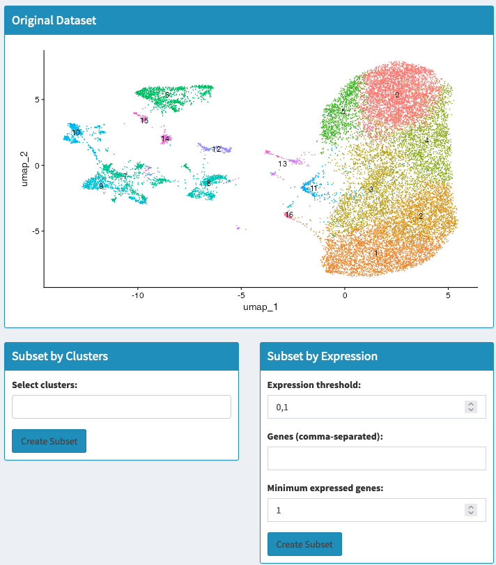
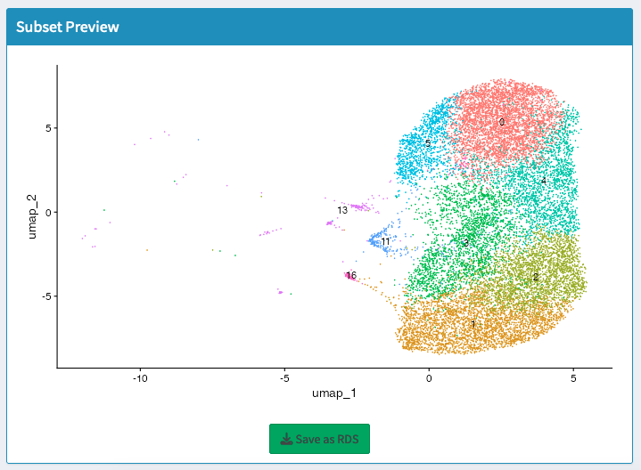

# Subset - Multiple Datasets

## Overview
This section allows you to create focused datasets by extracting specific cell populations, gene expression patterns, or metadata-defined groups from your integrated multi-dataset analysis. Subsetting helps concentrate analysis on relevant cell types while maintaining the integration and comparative structure.

## What You'll Do on This Tab
- **Extract specific clusters** from integrated datasets
- **Filter by gene expression** to find cells with particular signatures
- **Subset by metadata** to focus on specific experimental conditions
- **Create comparative subsets** maintaining dataset relationships
- **Export focused datasets** for specialized downstream analysis

## Subsetting Methods Available

### Method 1: Subset by Clusters

**When to use**: Focus on specific cell types across all datasets

**Setup**:
- **View global UMAP** showing all clusters across datasets
- **Select clusters to retain** using dropdown menu
- **Multiple cluster selection** to keep related cell types
- **Click "Apply cluster based subset"**

**What you get**: New dataset containing only selected clusters from all datasets

**Example uses**:
- Extract immune cells (multiple clusters) for immune-focused analysis
- Focus on stem/progenitor populations across treatment conditions
- Remove contaminating cell types from comparative analysis

### Method 2: Subset by Gene Expression

**When to use**: Find cells expressing specific gene combinations across datasets

**Setup**:
- **Enter genes** separated by commas (e.g., "Pax7, Myod1, Myog")
- **Set expression threshold**: Minimum level to count as expressing
- **Set minimum expressed genes**: How many from your list must be expressed
- **Click "Apply Gene Subsetting"**

**What you get**: Cells meeting gene expression criteria from all datasets

**Example uses**:
- Find activated cells expressing multiple activation markers
- Identify transitional states with mixed expression signatures
- Select pathway-active cells across treatment conditions

### Method 3: Subset by Metadata

**When to use**: Focus on specific experimental conditions or metadata groups

**Setup**:
- **Select metadata column**: Choose from available metadata fields
- **Choose values to keep**: Select specific conditions, treatments, or time points
- **Click "Apply Metadata Subset"**

**What you get**: Cells from selected metadata categories only

**Example uses**:
- Keep only specific treatment conditions
- Focus on particular time points
- Compare specific experimental groups



## Visualization and Validation

### Original Dataset View
- **Global UMAP**: Shows complete integrated dataset
- **All conditions**: Displays relationship between all datasets
- **Reference visualization**: For comparing subset results

### Subset Preview
- **Filtered UMAP**: Shows only selected cells
- **Maintains coordinates**: Easy comparison with original
- **Preserves integration**: Dataset relationships maintained

### Quality Assessment
- **Cell count verification**: Check adequate cells remain
- **Dataset representation**: Ensure all relevant datasets included
- **Biological coherence**: Verify subset makes biological sense



## Combination Strategies

### Sequential Subsetting
- **First by metadata**: Focus on relevant experimental conditions
- **Then by clusters**: Extract specific cell types from those conditions
- **Finally by expression**: Refine to cells with particular signatures

### Comparative Subsetting
- **Maintain dataset structure**: Keep comparative relationships intact
- **Balanced representation**: Ensure fair comparison between conditions
- **Control consistency**: Preserve experimental design structure

## Analysis Pipeline

### Step 1: Define Your Research Focus
- **Identify cell populations** of interest across all datasets
- **Consider downstream analyses** to be performed
- **Plan subset strategy** to maintain statistical power

### Step 2: Choose Subsetting Method
- **For well-defined cell types**: Use cluster-based subsetting
- **For functional states**: Use gene expression criteria
- **For condition focus**: Use metadata subsetting
- **For complex selections**: Combine multiple methods

### Step 3: Execute Subsetting
- **Configure parameters** based on your research question
- **Generate subset** using selected method
- **Validate results** using visualization tools

### Step 4: Quality Control
- **Check cell numbers**: Ensure sufficient cells for analysis
- **Verify representation**: Confirm all relevant datasets included
- **Biological validation**: Ensure subset maintains biological coherence

### Step 5: Export and Document
- **Save subset object**: Export as .rds file for future use
- **Document parameters**: Record selection criteria
- **Plan downstream analysis**: Prepare for specialized studies

```{tip}
Always validate your subset by comparing the original vs subset UMAPs. A good subset should maintain biological relationships while focusing on your populations of interest.
```

## Export 

### Save Subset Object
- **Click "Save subset as .RDS"** to export filtered dataset
- **Preserves integration**: Maintains dataset relationships
- **Includes metadata**: All annotations and labels preserved
- **Ready for analysis**: Can be loaded for specialized studies

