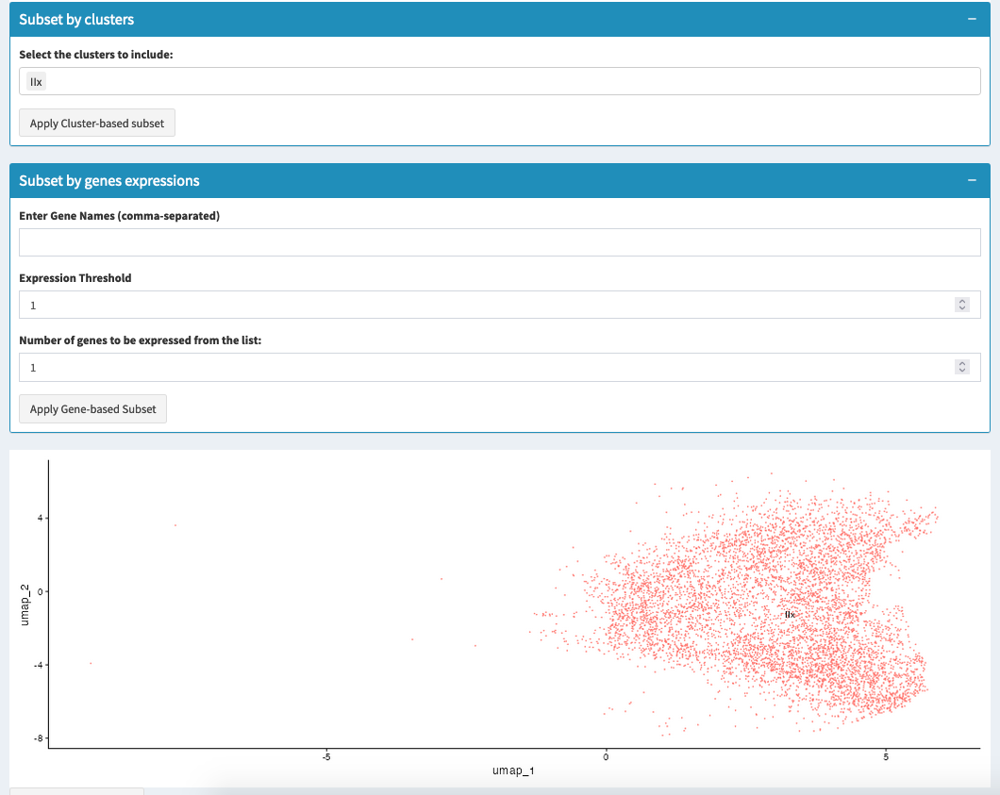

==========================
Subset
==========================

Subsetting your data allows you to focus on specific cell populations or conditions for a more targeted analysis. This approach is beneficial when dealing with large datasets or when interested in a particular subset of cells.

### Concept of Subsetting

Subsetting involves selecting a specific portion of the data based on certain criteria, such as cluster identities or gene expression levels. This process is useful for:

- Focusing on specific cell types or states within a dataset.
- Reducing data complexity to enhance the clarity of subsequent analyses.
- Conducting targeted analyses on specific cell populations or conditions.

### How to Create and Use Subsets

1. **Cluster-Based Subsetting**:  
   - Select clusters of interest based on their biological relevance or experimental focus.
   - Use the "Subset by Clusters" section in the interface to select clusters to include in the subset.
   - Click "Apply Cluster-based Subset" to generate a new Seurat object containing only the selected clusters.

2. **Gene Expression-Based Subsetting**:  
   - Define subsets based on the expression levels of specific genes or sets of genes.
   - Enter the gene names (comma-separated) in the "Subset by Gene Expressions" section and set the expression threshold.
   - Specify the minimum number of genes from the list that should be expressed.
   - Click "Apply Gene-based Subset" to create a subset of cells that meet the defined gene expression criteria.

3. **Subset Visualization**:  
   - Visualize the UMAP plot of the original data and the subsetted data to confirm the selection.
   - Use these plots to explore the distribution of selected clusters or gene expression patterns within the subset.

### Interface Usage

1. **UMAP Plot**:  
   - The interface provides a UMAP plot of the entire dataset for an overview of the cell populations. This helps in identifying clusters for subsetting.
   
2. **Cluster-Based Subsetting**:  
   - Select clusters from the dropdown menu to include in the subset.
   - Click "Apply Cluster-based Subset" to generate a subset containing only the selected clusters.
   
3. **Gene Expression-Based Subsetting**:  
   - Enter the names of genes you want to use for subsetting and specify the expression threshold.
   - Define how many of these genes should be expressed in the cells to include them in the subset.
   - Click "Apply Gene-based Subset" to create a subset based on the specified gene expression criteria.

4. **Downloading Subsets**:  
   - After creating a subset, you can download it as an `.rds` file by clicking "Save subset as .RDS".
   - This allows you to save and reuse subsets for further analysis or sharing.

.. tip::  
   Subsetting is useful for focusing on specific biological questions. Always verify the subset contains sufficient data for meaningful analysis.

.. warning::  
   Overly restrictive subsetting criteria can lead to loss of important data. Ensure that the subset is representative of the full biological diversity of the original dataset.

### Applications

- **Targeted Analysis**:  
  Conduct in-depth analyses on specific cell types or states within a dataset.
  
- **Data Reduction**:  
  Simplify datasets by focusing on a subset of interest, making downstream analyses more manageable and interpretable.
