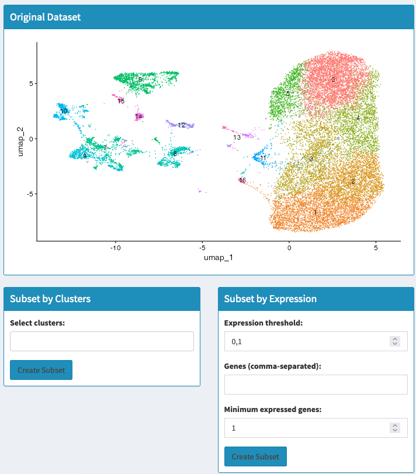
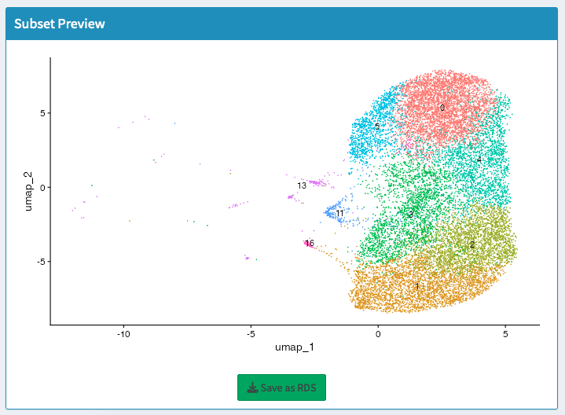

Subset
==========================

Overview
--------------------
Subsetting your data allows you to focus on specific cell populations or conditions for a more targeted analysis. This approach is beneficial when dealing with large datasets or when interested in a particular subset of cells.

Concept of Subsetting
--------------------
Subsetting involves selecting a specific portion of the data based on certain criteria, such as cluster identities or gene expression levels. This process is useful for:
- Focusing on specific cell types or states within a dataset
- Reducing data complexity to enhance the clarity of subsequent analyses
- Conducting targeted analyses on specific cell populations or conditions

Creating and Using Subsets
--------------------

Cluster-Based Subsetting
--------------------
- Select clusters of interest based on their biological relevance or experimental focus
- Use the "Subset by Clusters" section to select clusters to include
- Click "Apply Cluster-based Subset" to generate a new Seurat object containing only the selected clusters

Gene Expression-Based Subsetting
--------------------
- Define subsets based on the expression levels of specific genes
- Enter gene names (comma-separated) in the "Subset by Gene Expressions" section
- Set expression threshold and minimum number of expressed genes
- Click "Apply Gene-based Subset" to create subset based on gene expression criteria

Subset Visualization
--------------------
- Visualize UMAP plots of original and subsetted data
- Explore distribution of selected clusters or gene expression patterns
- Confirm selection accuracy

Using the Interface
--------------------

UMAP Plot
--------------------
- View UMAP plot of entire dataset
- Identify clusters for subsetting
- Explore cell population overview

Cluster Selection
--------------------
- Select clusters from dropdown menu
- Choose multiple clusters if needed
- Apply cluster-based subset

Gene Expression Criteria
--------------------
- Enter gene names for subsetting
- Specify expression threshold
- Define minimum expressed genes requirement

Downloading Results
--------------------
- Download subset as .rds file
- Click "Save subset as .RDS"
- Save for further analysis or sharing