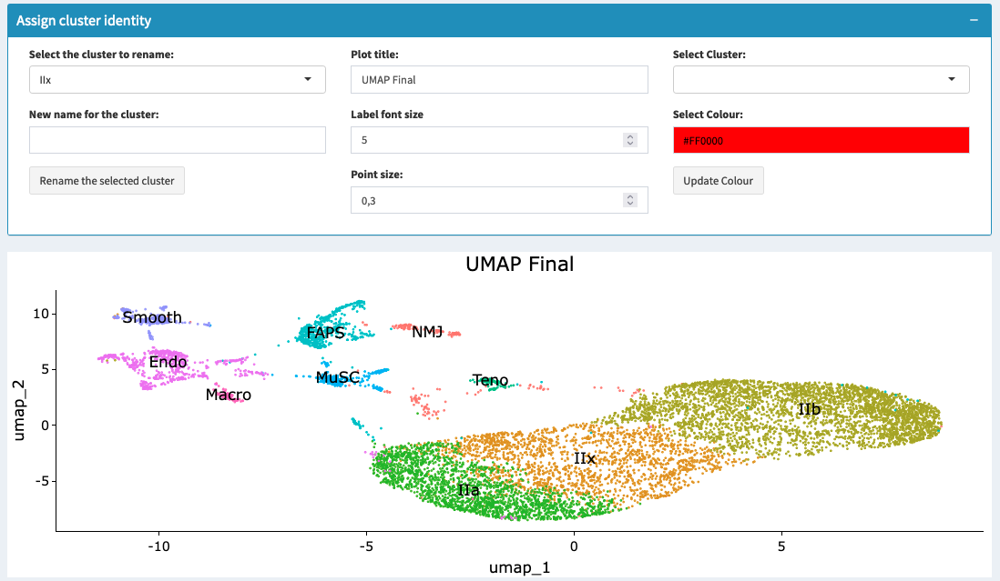

====================================
Assigning Cell Type Identity
====================================

### Overview

This section allows users to manually assign or modify cell type identities based on marker gene expression and clustering results.

### Steps to Assign Cell Types

1. **Select Cluster**: Choose the cluster for which you want to assign or modify the cell type identity.
2. **Enter New Identity**: Provide a new cell type label for the selected cluster.
3. **Apply Changes**: Click "Assign Identity" to update the cell type identity.

.. tip::
   Use known marker genes to guide the assignment of cell type identities. Consult relevant literature or databases for marker gene information.

### Visualizing Assigned Identities

- **UMAP/t-SNE Plot**: Visualize the updated cell type identities on the dimensional reduction plot.
