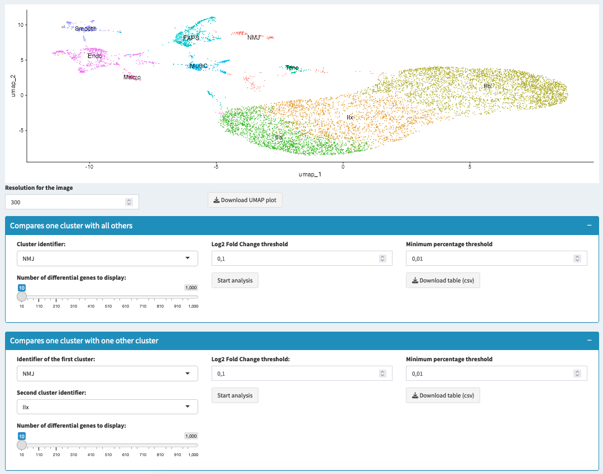

===============================
Cluster Biomarkers
===============================

Overview
Cluster biomarkers are genes that show distinctive expression patterns in specific clusters. This section provides tools to identify such biomarkers through differential expression analysis between clusters.

Analysis Methods

1. One vs All Comparison
- **Purpose**: Find cluster-specific markers
- **Process**:
  * Compares one cluster against all others
  * Identifies uniquely expressed genes
  * Ranks by significance and fold change

2. Pairwise Comparison
- **Purpose**: Compare specific clusters
- **Process**:
  * Analyzes two selected clusters
  * Shows direct expression differences
  * Highlights cluster-specific features

Analysis Parameters

Expression Thresholds
- **Log2 Fold Change**:
  * < 0.5: Subtle differences
  * 0.5-1: Moderate changes
  * > 1: Strong differences
  * Default: 0.1

Statistical Controls
- **Minimum Percentage**:
  * Controls expression frequency
  * Range: 0.01-1.0
  * Default: 0.1 (10% of cells)

Results Interpretation

Biomarker Table Columns
- **Gene**: Gene identifier
- **p_val**: Statistical significance
- **avg_log2FC**: Expression difference
- **pct.1/pct.2**: Expression percentage
- **p_val_adj**: Adjusted p-value

Quality Assessment
- **Strong Markers**:
  * High fold change
  * Low p-value
  * High expression percentage
  * Known biological relevance

.. tip::
   * Start with standard thresholds
   * Consider biological context
   * Validate key markers
   * Compare with literature

.. warning::
   * Check multiple metrics
   * Avoid over-reliance on p-values
   * Consider expression patterns
   * Validate unexpected findings

Download Options
- Download results as CSV
- Include all statistics
- Sort by different metrics
- Filter before export
