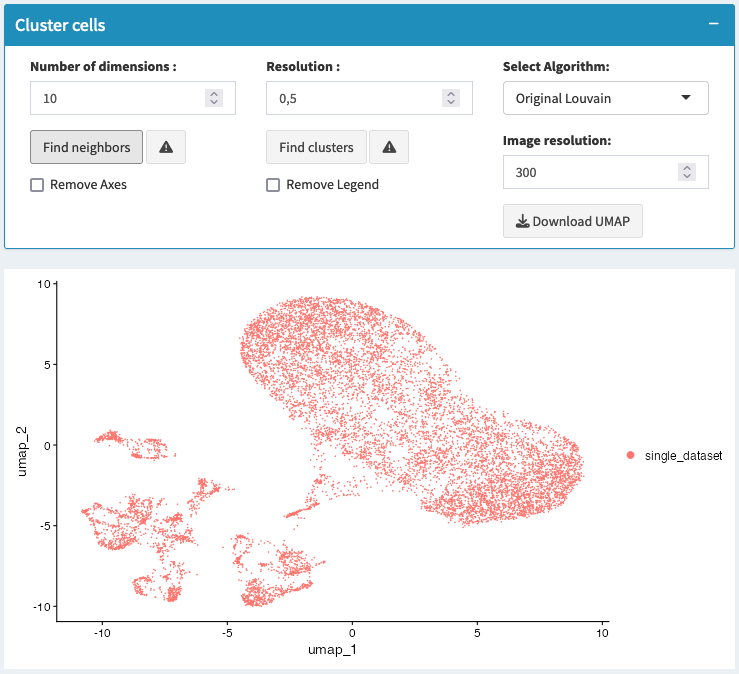
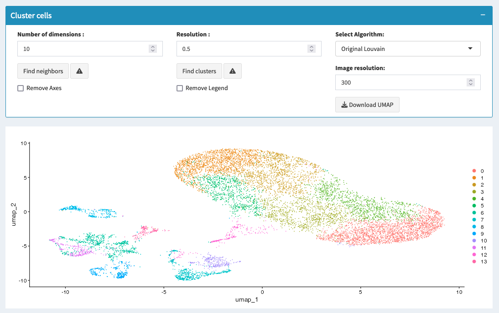

===========================
Clustering
===========================

### Overview

Clustering groups cells with similar gene expression profiles into clusters, which may correspond to different cell types or states.

### Steps to Cluster Cells

1. **Set Clustering Parameters**:
   - **Number of Dimensions**: Select the number of principal components to use for clustering.
   - **Resolution**: Adjust the resolution to control the granularity of the clusters. Higher values produce more clusters, while lower values yield fewer, larger clusters.
   - **Algorithm**: Choose the clustering algorithm (e.g., Louvain, Leiden).

2. **Run Clustering**: Click "Find Clusters" to execute the clustering algorithm.

.. tip::
   Start with a resolution of 0.5 and adjust based on the clustering results. Use visualization tools like UMAP to evaluate the quality of clustering.

.. warning::
   Over-clustering can result in artificial clusters that do not represent true biological differences. Be cautious with high-resolution settings.

### Visualizing Clusters

- **UMAP/t-SNE Plot**: Use these plots to visualize clusters and assess their separation.

### Common Issues

- **Clusters are not well-separated**: Adjust the resolution or use more principal components.
- **Too many small clusters**: Lower the resolution 