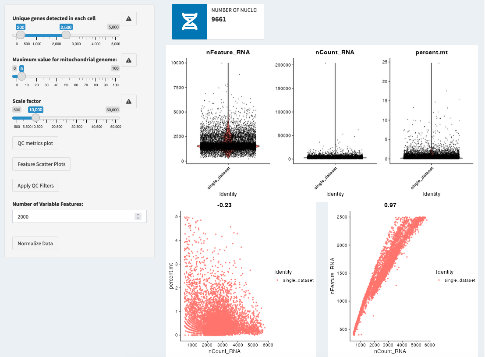
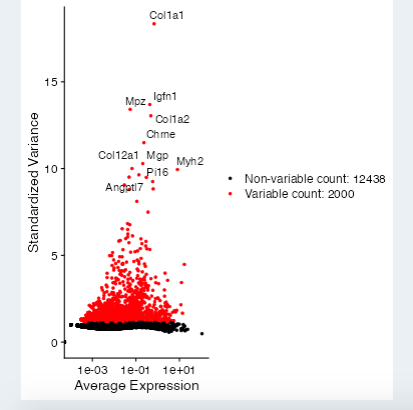

Data Cleanup & Variable Features
==============================

Overview
--------------------
Quality control (QC) and data cleanup are essential steps in single-cell RNA sequencing analysis. This process ensures reliable results by removing low-quality cells and normalizing gene expression data.

Quality Control Metrics
--------------------

1. Unique Genes (nFeature_RNA)
- **What it measures**: Number of different genes detected in each cell
- **Why it matters**: 
  * Too few genes: May indicate empty droplets or dead cells
  * Too many genes: May indicate doublets (two cells captured together)
- **Typical ranges**:
  * scRNA-seq: 500-5000 genes
  * snRNA-seq: 200-3000 genes

2. Mitochondrial Content
- **What it measures**: Percentage of transcripts from mitochondrial genes
- **Why it matters**: High mitochondrial content often indicates dying cells
- **Typical thresholds**:
  * scRNA-seq: <5-10%
  * snRNA-seq: <2-5% (lower due to nuclear isolation)

Step-by-Step Quality Control
--------------------

1. Examine QC Metrics
- View violin plots of key metrics
- Look for clear outlier populations
- Consider biological expectations for your cell types

2. Set Quality Thresholds
- Adjust the nFeature slider based on your distribution
- Set mitochondrial percentage threshold
- Consider your biological context when setting cutoffs

3. Apply Filters
- Click "Apply QC Filters" to remove low-quality cells
- Monitor the number of cells retained
- Check the distribution of remaining cells

Normalization
--------------------

1. Scale Factor
- Default: 10,000 (standard for most analyses)
- Adjustable based on library size distribution
- Higher factors can help with very sparse data

2. Normalization Method
- Log-normalization: Standard approach
- Accounts for sequencing depth differences
- Makes data more suitable for downstream analysis

Variable Feature Selection
--------------------

Selection Process
1. Choose Number of Features
- Default: 2000 genes
- Adjust based on:
  * Dataset size
  * Biological complexity
  * Analysis goals

2. Selection Method
- Variance-stabilizing transformation (VST)
- Identifies genes with high cell-to-cell variation
- Accounts for mean-variance relationship

Visualization and Quality Assessment
--------------------

1. QC Violin Plots
- Shows distribution of key metrics
- Helps identify appropriate cutoffs
- Updates after filtering

2. Feature-Feature Plots
- Relationship between different metrics
- Helps identify outlier populations
- Guides threshold selection

3. Variable Features Plot
- Shows most variable genes
- Highlights selection thresholds
- Helps verify feature selection

.. tip::
   * Start with standard thresholds and adjust based on your data
   * Consider your biological question when setting cutoffs
   * Document your QC decisions for reproducibility

.. warning::
   * Overly strict filtering can remove rare cell types
   * Too lenient filtering can introduce technical artifacts
   * Always balance stringency with biological relevance