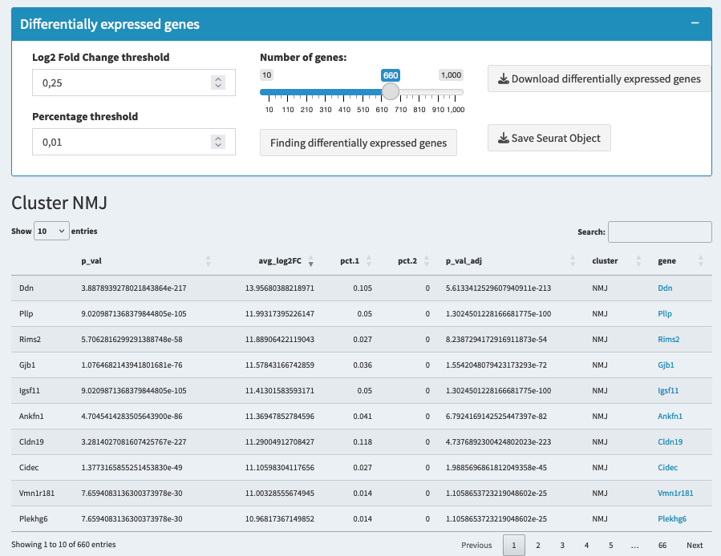

# Differentially Expressed Genes (DEGs)

## Overview
Identifying **Differentially Expressed Genes (DEGs)** is essential for understanding the biological differences between cell clusters or experimental conditions. DEGs are genes that show statistically significant differences in expression between groups of cells.

## Parameters and Their Impact

### Log Fold Change (logFC)
- Definition: Measures expression difference between groups on logarithmic scale
- Interpretation:
  * logFC of 1 = gene expressed 2x more
  * logFC of 2 = gene expressed 4x more
  * Negative values indicate lower expression
- Typical Thresholds:
  * Conservative: > 0.5
  * Standard: > 0.25
  * Permissive: > 0.1

### Percentage Threshold
- Purpose: Controls minimum cell expression requirement
- Settings:
  * Strict (25%): More confident results
  * Standard (10%): Balanced approach
  * Permissive (1%): Captures rare expression
- Impact: Higher values reduce false positives

## Running the Analysis
1. **Set Parameters**
   - Adjust logFC threshold
   - Set percentage threshold
   - Choose number of genes to display
2. **Execute Analysis**
   - Click "Find DEGs"
   - Wait for computation
   - Review results table

## Results Interpretation

### DEG Table Columns
- Gene: Gene identifier
- Average Expression: Mean expression level
- Percentage Cells: Fraction of cells expressing gene
- Log2 Fold Change: Expression difference
- P-value: Statistical significance
- Adjusted P-value: Corrected for multiple testing

### Interactive Features
- Click gene names for Protein Atlas links
- Sort columns to prioritize genes
- Filter results as needed

### Data Export Options
- Download DEGs: CSV format with all statistics
- Save Seurat Object: Complete analysis state

> **Warning:**
> * Low thresholds = more false positives
> * High thresholds might miss subtle changes
> * Always validate important genes
> * Consider biological context