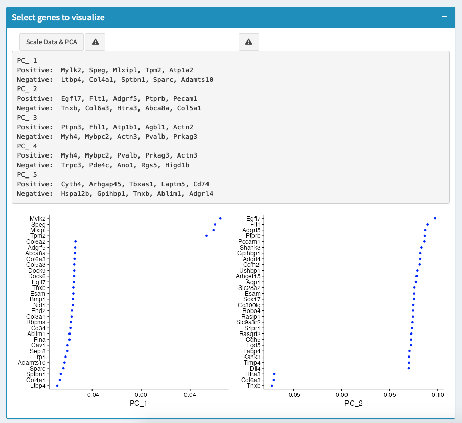

==========================
Dimensional Reduction
==========================

### Overview

Dimensional reduction techniques like PCA, t-SNE, and UMAP help in reducing the dimensionality of high-dimensional data, making it easier to visualize and interpret.

### Methods Supported

- **Principal Component Analysis (PCA)**: A linear dimensional reduction technique that reduces the data to a set of principal components that capture the maximum variance.
- **t-Distributed Stochastic Neighbor Embedding (t-SNE)**: A non-linear dimensional reduction method ideal for visualizing high-dimensional data.
- **Uniform Manifold Approximation and Projection (UMAP)**: A more recent method that preserves the global structure of the data while providing a clear separation of clusters.

### How to Perform Dimensional Reduction

1. **Select the Reduction Method**: Choose between PCA, t-SNE, or UMAP based on the data characteristics and analysis goals.
2. **Set Parameters**: Adjust the number of dimensions (principal components) to retain and other method-specific parameters.
3. **Run Analysis**: Click "Run Dimensional Reduction" to start the analysis.

.. tip::
   Begin with PCA for an initial dimensional reduction, then use UMAP or t-SNE for visualization. UMAP is often preferred for its balance between local and global structure preservation.

.. warning::
   Choosing too few dimensions can oversimplify the data, while too many dimensions may introduce noise. Typically, retaining between 10 to 20 principal components is ideal for single-cell RNA sequencing data.

### Visualizing Results

- **Elbow Plot**: Use the Elbow Plot to determine the optimal number of principal components to retain.
- **PCA Plot**: Visualize the principal components to understand the variance captured by each.

### Common Issues

- **Overlapping clusters in visualization**: Try adjusting the number of dimensions or switching to a different reduction method (e.g., from t-SNE to UMAP).
- **No clear separation between clusters**: Increase the number of neighbors or change the perplexity (for t-SNE) or minimum distance (for UMAP) to fine-tune the clustering visualization.
