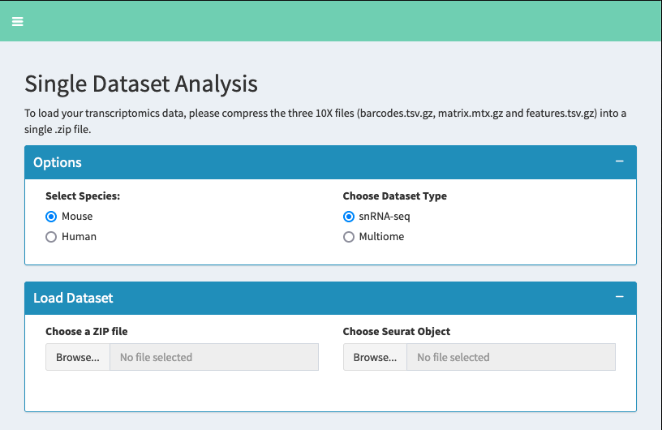

Load Dataset
====================

Overview
--------------------
The dataset loading section is the entry point for analyzing your single-cell RNA sequencing data. This section guides you through loading and initializing your data for downstream analysis.

Data Types and Requirements
--------------------

Option 1: Raw 10X Genomics Data

Required files (compressed in a single ``.zip``):

* ``barcodes.tsv.gz``: Contains cell barcodes
* ``matrix.mtx.gz``: Contains the expression matrix
* ``features.tsv.gz``: Contains gene information
  
Option 2: Pre-processed Seurat Object

* Format: ``.rds`` file
* Requirements: Must be a valid Seurat object (version 4 or higher)

Step-by-Step Loading Process
--------------------

1. Select Species

   * Choose between "Mouse" or "Human"
   * This selection affects gene name formatting and mitochondrial gene detection

2. Choose Data Type

   * **snRNA-seq**: For single-nucleus RNA sequencing data
   * **Multiome**: For multi-modal data including RNA-seq
   
3. Upload Data

   * Click "Choose File" to select your data
   * For 10X data: Select your ``.zip`` file
   * For Seurat object: Select your ``.rds`` file

4. Data Processing

   The application will automatically:

   * Validate file format and content
   * Create a Seurat object (for 10X data)
   * Initialize necessary parameters
   * Prepare data for analysis

Important Notes
--------------------

.. tip::
   * Ensure your files are properly formatted before uploading
   * Check file sizes - large datasets may take longer to process
   * Keep original files backed up before processing

.. warning::
   Common Issues:

   * Missing files in ZIP archive
   * Corrupted .rds files
   * Incompatible Seurat object versions
   * Memory limitations with very large datasets

References
--------------------

1. Hao et al., Dictionary learning for integrative, multimodal and scalable single-cell analysis. https://doi.org/10.1038/s41587-023-02100-3
2. https://satijalab.org/seurat/articles/get_started_v5_new