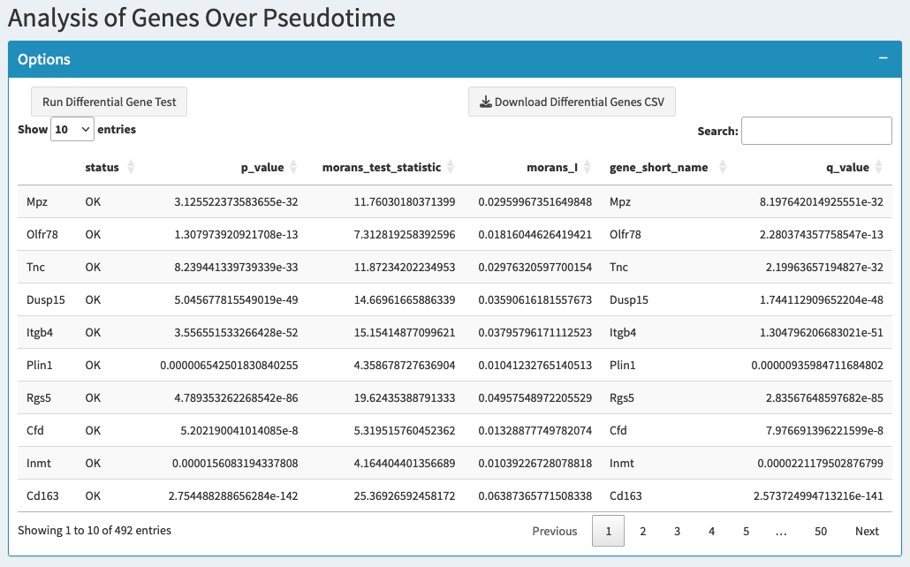
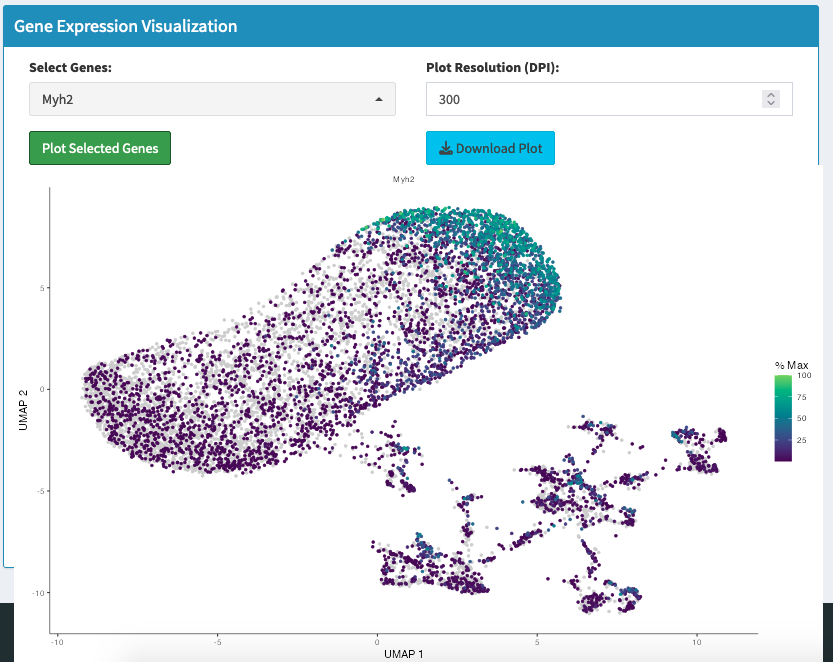

# Genes Pseudotime

## Overview
This section identifies genes that change their expression patterns along the trajectory and visualizes how specific genes are expressed during the developmental progression. You can discover which genes drive the biological process and see their dynamic expression patterns over pseudotime.

## What You'll Do on This Tab
- **Find genes that change significantly** along the pseudotime trajectory
- **Visualize gene expression dynamics** to see how genes turn on/off during development
- **Export differential expression results** for pathway analysis and further investigation
- **Study specific genes of interest** and their expression patterns along the trajectory

## Analysis Pipeline

### Step 1: Differential Expression Analysis

**Run Differential Gene Test**
- Click "Run Differential Gene Test" to identify genes that vary significantly over pseudotime
- Analysis uses statistical testing to find genes with significant expression changes
- Results show genes that drive the biological process along the trajectory
- Generates a ranked list of trajectory-associated genes

**What the Analysis Does**:
- Tests each gene for significant expression changes along pseudotime
- Calculates statistical significance (q-values) for each gene
- Identifies genes that increase, decrease, or show complex patterns
- Ranks genes by their importance in the developmental process

**Results Table Columns**:
- **Gene**: Gene identifier/name
- **Status**: Whether the gene passed statistical filters
- **num_cells_expressed**: Number of cells expressing the gene
- **morans_test_statistic**: Statistical measure of pseudotime association
- **morans_I**: Measure of spatial autocorrelation along trajectory
- **q_value**: Adjusted p-value for statistical significance (use < 0.05)

### Step 2: Filter and Prioritize Results

**q-value Cutoff**
- Set significance threshold using the q-value slider (default: 0.05)
- Lower values = more stringent selection, fewer but more confident genes
- Higher values = more permissive, includes more potential candidates
- Table automatically updates to show only significant genes

**Prioritization Strategy**:
- Focus on genes with lowest q-values for highest confidence
- Consider genes with high Moran's I values for strong trajectory association
- Look for genes expressed in sufficient cell numbers for robust analysis

### Step 3: Gene Expression Visualization

**Select Genes for Visualization**
- Use the gene picker to select specific genes from the results table
- Choose genes with significant q-values and biological relevance
- Can select multiple genes to see expression patterns simultaneously
- Search function helps find specific genes of interest

**Generate Expression Plots**
- Click "Generate Plot" to visualize selected genes along the trajectory
- Shows how gene expression changes over pseudotime
- Each gene gets its own panel showing expression dynamics
- Color indicates expression level along the developmental progression

**Plot Interpretation**:
- **X-axis**: Pseudotime progression (early to late development)
- **Y-axis**: Expression level for each gene
- **Color gradient**: Expression intensity across trajectory
- **Trajectory path**: Shows the developmental route through gene expression space

## Export and Documentation

### Download Options

**Download Results**
- Click "Download Results (CSV)" to export complete differential expression analysis
- Includes all genes with statistical measures and significance values
- Use for pathway enrichment analysis and literature validation
- Contains complete dataset for further computational analysis

**Download Plots**  
- Save gene expression visualizations in multiple formats
- **Format options**: PNG, PDF, TIFF for different uses
- **Resolution control**: Adjust DPI for publication quality
- High-resolution exports suitable for presentations and manuscripts

