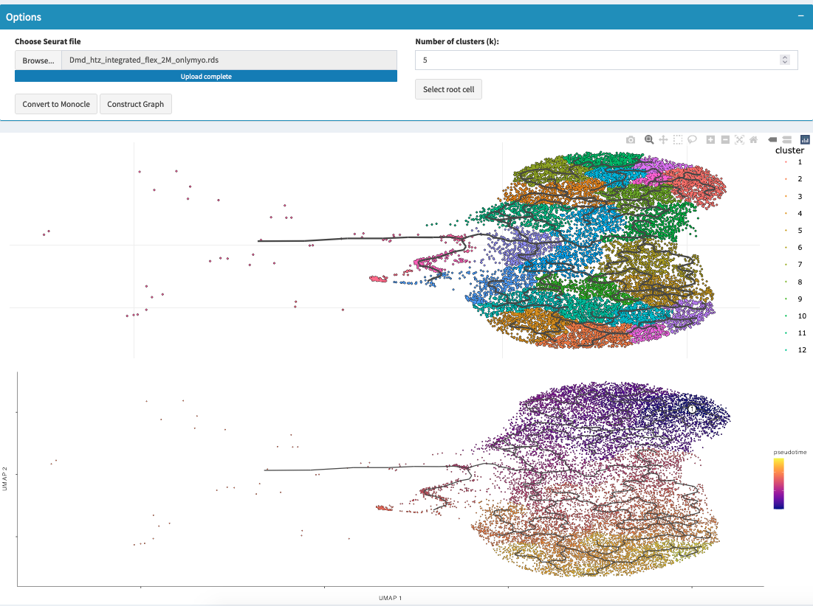

# Trajectory Analysis

## Overview
Monocle is a powerful tool for analyzing single-cell expression data that reconstructs developmental or differentiation trajectories of cells. It orders cells based on their transcriptional similarity to create a "pseudotime" trajectory, revealing how cells progress through biological processes like differentiation, cell cycle, or response to stimuli.

## What You'll Do on This Tab
- **Load your Seurat object** containing clustered single-cell data
- **Convert to Monocle format** for trajectory analysis
- **Construct trajectory graph** based on transcriptional similarities
- **Select root cell cluster** representing the starting point of your biological process
- **Calculate pseudotime** to order cells along the developmental trajectory
- **Visualize results** with cluster and pseudotime UMAP plots

## Why Use Monocle for Trajectory Analysis?
- **Reconstruct developmental progressions** from stem cells to differentiated states
- **Identify branch points** where cells make fate decisions
- **Order cells in biological time** rather than experimental time
- **Understand gene expression dynamics** during cellular transitions
- **Validate developmental hierarchies** suggested by clustering

For detailed information and advanced features, visit the official [Monocle Documentation](http://cole-trapnell-lab.github.io/monocle3/).

## Analysis Pipeline

### Step 1: Load Your Seurat Object

**Data Requirements**:
- **Clustered Seurat object** with clear cell type annotations
- **Quality-controlled data** with normalized expression values
- **Sufficient cells** representing developmental spectrum
- **Biological context** where trajectory analysis makes sense (development, differentiation, etc.)

**Loading Process**:
1. Click "Choose Seurat file (.rds)" under file input
2. Select your preprocessed and clustered Seurat object
3. System validates data and displays dataset information
4. Check cell count and cluster information boxes

**Expected Data**:
- Stem cells, progenitors, and differentiated cells in the same dataset
- Clear clustering that suggests developmental relationships
- Adequate cell numbers per developmental stage

### Step 2: Convert to Monocle Format

**Conversion Process**:
- Click "Convert to Monocle" to transform your Seurat object
- System creates a cell_data_set object compatible with Monocle
- Preserves expression data, cell metadata, and dimensional reductions
- Prepares data for trajectory construction

**What Happens**:
- Expression matrix is transferred to Monocle format
- Cell annotations and cluster information preserved
- UMAP coordinates maintained for visualization consistency
- Gene metadata prepared for trajectory analysis

### Step 3: Construct Trajectory Graph

**Graph Construction**:
- Click "Construct Graph" to build the trajectory backbone
- System creates a principal graph connecting similar cells
- Graph represents potential developmental paths through your data
- Forms the foundation for pseudotime calculation

**Algorithm Details**:
- Uses transcriptional similarity to connect neighboring cells
- Creates branching structure representing developmental choices
- Identifies potential endpoints and branch points
- Prepares framework for cell ordering

### Step 4: Select Root Cell Cluster

**Root Selection Purpose**:
- Defines the starting point of your developmental trajectory
- Should represent the earliest or most primitive cell state
- All other cells will be ordered relative to this starting point

**How to Choose Root**:
1. **Select root cluster** from the dropdown menu
2. Choose cluster representing:
   - Stem cells or progenitor populations
   - Earliest developmental stage
   - Most primitive transcriptional state
   - Known starting point of your biological process

**Common Root Choices**:
- Embryonic stem cells in development studies
- Tissue stem cells in adult regeneration
- Naive cells in differentiation experiments
- Early time points in time-course studies

### Step 5: Calculate Pseudotime

**Pseudotime Calculation**:
- Click "Calculate Pseudotime" to order cells along the trajectory
- System assigns each cell a pseudotime value
- Root cells get pseudotime = 0
- Other cells get increasing values based on trajectory distance

**Pseudotime Interpretation**:
- **Low pseudotime**: Cells close to root, early in process
- **High pseudotime**: Cells far from root, late in process
- **Pseudotime progression**: Represents biological progression, not experimental time

### Step 6: Visualize Trajectory Results

**Dual Visualization System**:

**Plot 1 - UMAP with Clusters**:
- Shows your original cluster annotations
- Displays cell type identities on UMAP coordinates
- Helps validate that trajectory connects expected cell types
- Reference for understanding which clusters participate in trajectory

**Plot 2 - UMAP with Pseudotime**:
- Same UMAP coordinates colored by pseudotime values
- Color gradient from early (dark) to late (light) pseudotime
- Shows progression of cells through developmental process
- Reveals trajectory structure and branch points

## References
1. http://cole-trapnell-lab.github.io/monocle-release/docs/#differentialgetest-details-and-options