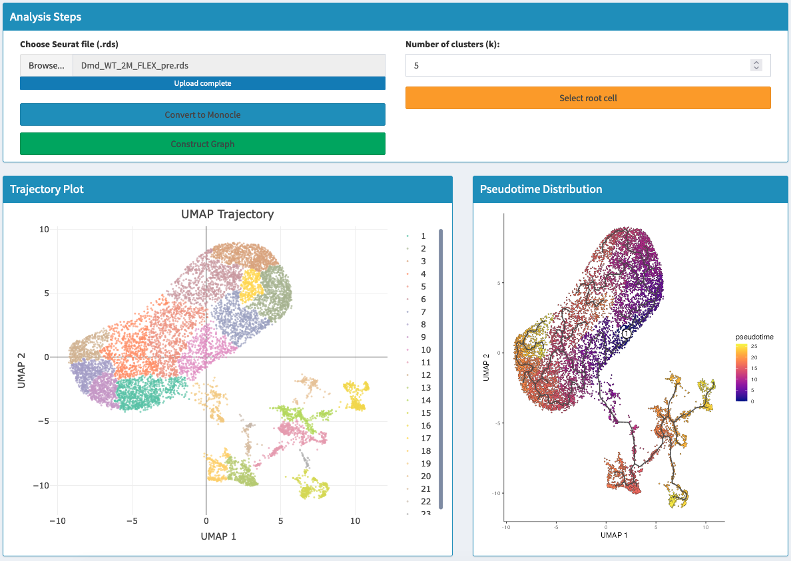

# Trajectory Analysis

## Overview
Trajectory Analysis is a powerful tool used to infer the developmental trajectory of cells from single-cell RNA sequencing data. This analysis helps in understanding differentiation paths and uncovering dynamic changes in gene expression over pseudo-time.

## Concept of Trajectory Analysis
Trajectory Analysis involves mapping cells along a continuum representing a biological process, such as differentiation, cell cycle progression, or response to stimuli. The goal is to order cells in a way that reflects their progression through a biological process, allowing for the identification of intermediate states and transitions between cell types.

## Key Steps in Analysis

### Data Preparation
- Begin by loading a Seurat object containing single-cell RNA sequencing data
- Convert the Seurat object into a Monocle object
- Use Monocle toolkit for reconstructing cell trajectories

### Graph Construction
- Construct a graph in reduced dimensional space (UMAP)
- Use cluster_cells to cluster cells
- Apply learn_graph to construct principal graph
- Capture potential developmental paths

### Root Selection and Ordering
- Select a root cell as starting point
- Often a stem or progenitor cell
- Order cells in pseudotime
- Track progression through development

## Using the Interface

### Step-by-Step Process
1. **Load the Seurat Object**
   - Upload single-cell data
   - Verify data integrity
2. **Convert to Monocle Object**
   - Click "Convert to Monocle"
   - Transform data format
3. **Construct the Graph**
   - Use "Construct Graph" button
   - Create principal graph
   - Represent developmental trajectory
4. **Select Root Cell**
   - Click "Select root cell"
   - Choose on UMAP plot
   - Confirm selection
5. **Order Cells**
   - Confirm root cell
   - Generate pseudotime ordering

> **Tip:**
> Use known biological markers to select an appropriate root cell to ensure that the trajectory aligns with known biological processes.

> **Warning:**
> Incorrect root cell selection can lead to misleading trajectory inference. Always validate the trajectory with biological knowledge.

## References
1. http://cole-trapnell-lab.github.io/monocle-release/docs/#differentialgetest-details-and-options